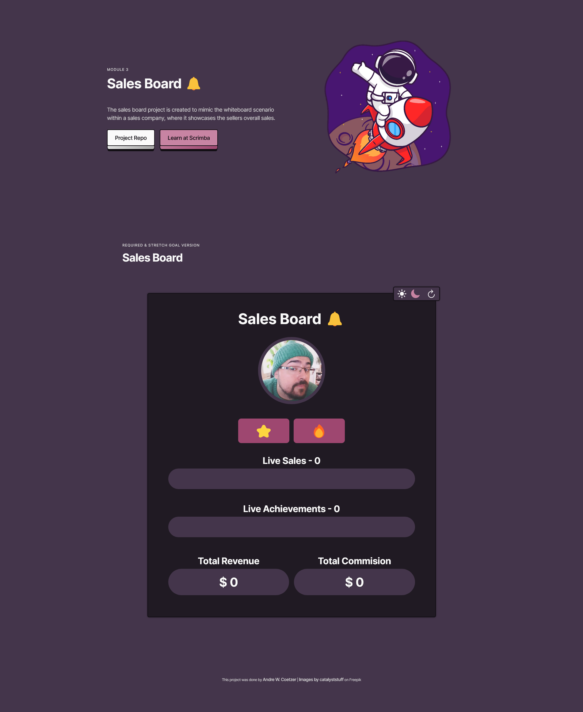
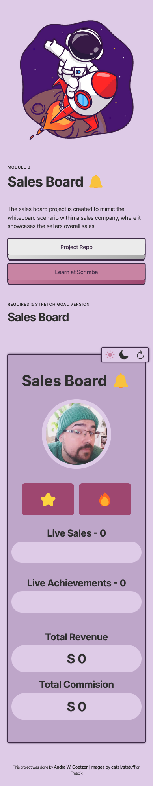

#### <a href="https://scrimba.com" target="_blank" alt="Scrimba's website">SCRIMBA | MODULE 3 | SALES BOARD</a> 

This is a solo project by <a href="https://scrimba.com/learn/frontend" target="_blank" alt="Scrimba's frontend career path web page">Scrimba's Frontend Career Path</a> for bootcamp members

#### <a href="https://sales-board-awcoetzer.netlify.app" target="_blank">view the live version here</a>


<br>

#### ABOUT
## What is the project all about?

The sales board project is created to mimic the whiteboard scenario within a sales company, where it showcases the sellers overall sales.  

This paticular project makes use of everything we have learn't so far in the course.

We were given a figma <a href="https://www.figma.com/file/7sKjOMc3s9LQ2rAnnSbI4V/Salesboard?type=design&node-id=0-1&t=gzhIphhBWvIYvywz-0" target="_blank" alt="Link to the Fogma design file">file</a> from which to design off of and given requirements & stretch goals to can complete the project, list can be seen [here](#project-goals--stretch-goals).

<br>

#### PROJECT SCREENS
## How the project looks

 

 

<br>

#### REQUIREMENTS
## This is what will be required to run this project

- Knowledge on HTML, CSS & JavaScript
- Editor | _recommendation: <a href="https://code.visualstudio.com/" target="_blank" src="Visual Studio Code Website">Visual Studio Code</a>_

<br>

#### TREE & BLOBS
## Repository file & directory layout

- [assets/](./assets/)
    - [css/](./assets/css/)
        - [styles.css](./assets/css/styles.css)
    - [images/](./assets/images/)
      - [favicon/](./assets/images/favicon/)
      - [hero/](./assets/images/hero/)
      - [project/](./assets/images/project/)
      - [readme/](./assets/images/readme/)
    - [javascript/](./assets/javascript/)
        - [app.js](./assets/javascript/app.js)
        - [themes.js](./assets/javascript/themes.js)
- [index.html](./index.html)
- [README.md](./README.md)
- [site.webmanifest](./site.webmanifest)

<br>

#### PROJECT GOALS & STRETCH GOALS
## What needs to be done for the project

##### REQUIRED

- Build it from scratch
- Follow the design
- Make use of everything you have learn't so far in Javascript, example:
  - Functions
  - Arrays
  - Loops
  - Objects

<br>

##### STRETCH GOALS

- Add more achievements
- Toggle between light and dark mode
- Store the data locally
- Have a reset button

<br>

#### DESIGN NOTES
## Figma file, Colours, Fonts & basic file setup pertaining to this project

- Figma file can be found <a href="https://www.figma.com/file/7sKjOMc3s9LQ2rAnnSbI4V/Salesboard?type=design&node-id=0-1&t=gzhIphhBWvIYvywz-0" target="_blank" alt="Link to the Fogma design file">here</a>
- Font used within project
  - ```html
      <link rel="preconnect" href="https://fonts.googleapis.com">
      <link rel="preconnect" href="https://fonts.gstatic.com" crossorigin>
      <link href="https://fonts.googleapis.com/css2?family=Inter:wght@400;500;700&family=Poppins:wght@700&display=swap" rel="stylesheet">
    ```

  - ```css
      --typeface-inter: 'Inter', sans-serif;
      --typeface-poppins: 'Poppins', sans-serif;
    ```

- Color palette used within project
  - ```css
        --clr-shadow: hsl(280, 15%, 6%);
        --clr-background: hsl(280, 15%, 12%);
        --clr-background-tint: hsl(281, 17%, 25%);
        --clr-headline: hsl(0, 0%, 98%);
        --clr-paragraph: hsl(0, 0%, 85%);
        --clr-button: hsl(0, 0%, 98%);
        --clr-button-text: var(--clr-shadow);
        --clr-button-before: linear-gradient(140deg,
          hsl(0, 0%, 95%),
          hsl(0, 0%, 65%));
        --clr-button-plus: var(--clr-accent-tint);
        --clr-button-plus-text: var(--clr-shadow);
        --clr-button-plus-before: linear-gradient(140deg,
          var(--clr-accent-tint),
          ar(--clr-accent));
        --clr-button-shadow: var(--clr-shadow);
        --clr-stroke: var(--clr-shadow);
        --clr-highlight: var(--clr-accent-tint);
        --clr-accent: hsl(332, 38%, 45%);
        --clr-accent-tint: hsl(332, 38%, 65%);
    ```

  - ```js
      const lightTheme = function () {
          document.documentElement.style.setProperty('--clr-shadow', 'hsl(280, 25%, 22%)');
          document.documentElement.style.setProperty('--clr-background', 'hsl(280, 25%, 72%)');
          document.documentElement.style.setProperty('--clr-background-tint', 'hsl(281, 37%, 85%)');
          document.documentElement.style.setProperty('--clr-headline', 'hsl(0, 0%, 18%)');
          document.documentElement.style.setProperty('--clr-paragraph', 'hsl(0, 0%, 15%)');
          document.documentElement.style.setProperty('--clr-button', 'hsl(0, 0%, 92%)');
          document.documentElement.style.setProperty(
              '--clr-button-before', 
              'linear-gradient(140deg, hsl(0, 0%, 90%), hsl(0, 0%, 65%))'
          );
          document.documentElement.style.setProperty('--clr-accen', 'hsl(332, 38%, 35%)');
          document.documentElement.style.setProperty('--clr-accent-tint', 'hsl(332, 38%, 65%)');
      }

    const darkTheme = function () {
        document.documentElement.style.setProperty('--clr-shadow', 'hsl(280, 15%, 6%)');
        document.documentElement.style.setProperty('--clr-background', 'hsl(280, 15%, 12%)');
        document.documentElement.style.setProperty('--clr-background-tint', 'hsl(281, 17%, 25%)');
        document.documentElement.style.setProperty('--clr-headline', 'hsl(0, 0%, 98%)');
        document.documentElement.style.setProperty('--clr-paragraph', 'hsl(0, 0%, 85%)');
        document.documentElement.style.setProperty('--clr-button', 'hsl(0, 0%, 98%)');
        document.documentElement.style.setProperty(
            '--clr-button-before',
            'linear-gradient(140deg, hsl(0, 0%, 95%), hsl(0, 0%, 65%))'
        );
        document.documentElement.style.setProperty('--clr-accen', 'hsl(332, 38%, 45%)');
        document.documentElement.style.setProperty('--clr-accent-tint', 'hsl(332, 38%, 65%)');
    }
    ```

- General project variables layout
  - ```css
    :root {
      /* generic document setup */
      /* typeface */
      --typeface-sans: 'Inter', sans-serif;

      /* percentage fonts */
      --percentage-font-10: 62.5%;
      --percentage-font-9: 56.25%;
      --percentage-font-8: 50%;
      --percentage-font-7: 43.75%;

      /* font size */
      --font-10: 1rem;
      --font-12: 1.2rem;
      --font-14: 1.4rem;
      --font-16: 1.6rem;
      --font-18: 1.8rem;
      --font-20: 2rem;
      --font-24: 2.4rem;
      --font-30: 3rem;
      --font-32: 3.2rem;
      --font-36: 3.6rem;
      --font-44: 4.4rem;
      --font-52: 5.2rem;
      --font-62: 6.2rem;
      --font-74: 7.4rem;
      --font-86: 8.6rem;
      --font-98: 9.8rem;

      /* font weight */
      --font-weight-400: 400;
      --font-weight-500: 500;
      --font-weight-700: 700;

      /* spacing system */
      --spacing-2: 0.2rem;
      --spacing-4: 0.4rem;
      --spacing-8: 0.8rem;
      --spacing-12: 1.2rem;
      --spacing-16: 1.6rem;
      --spacing-24: 2.4rem;
      --spacing-32: 3.2rem;
      --spacing-48: 4.8rem;
      --spacing-64: 6.4rem;
      --spacing-80: 8rem;
      --spacing-96: 9.6rem;
      --spacing-128: 12.8rem;

      /* border radius */
      --border-rad-05: 0.5rem;
      --border-rad-1: 1rem;
      --border-rad-100: 10rem;
      --border-rad-round: 50%;

      /* line height */
      --line-height-1: 1;
      --line-height-11: 1.1;
      --line-height-15: 1.5;
      --line-height-17: 1.7;

      /* letter spacing */
      --letter-space-n05: -0.5px;
      --letter-space-n1: -1px;
      --letter-space-p05: 0.5px;
      --letter-space-p1: 1px;

      /* color palettes */
        --clr-shadow: ;
        --clr-background: ;
        --clr-background-tint: ;
        --clr-headline: ;
        --clr-paragraph: hsl(0, 0%, 85%);
        --clr-button: hsl(0, 0%, 98%);
        --clr-button-text: var(--clr-shadow);
        --clr-button-before: linear-gradient(140deg,
          hsl(0, 0%, 95%),
          hsl(0, 0%, 65%));
        --clr-button-plus: var(--clr-accent-tint);
        --clr-button-plus-text: var(--clr-shadow);
        --clr-button-plus-before: linear-gradient(140deg,
          var(--clr-accent-tint),
          var(--clr-accent));
        --clr-button-shadow: var(--clr-shadow);
        --clr-stroke: var(--clr-shadow);
        --clr-highlight: var(--clr-accent-tint);
        --clr-accent: ;
        --clr-accent-tint: ;
    }
    ```

- headings
  - pre-heading
    - ```css
        font-size: var(--font-12);
        margin-bottom: var(--spacing-12);
        ...
      ```
  - heading-primary
    - ```css
        font-size: var(--font-44);
        margin-bottom: var(--spacing-48);
        ...
      ```
  - heading-secondary
    - ```css
        font-size: var(--font-36);
        margin-bottom: var(--spacing-96);
        ...
      ```
  - heading-tertiary
    - ```css
        font-size: var(--font-32);
        margin-bottom: var(--spacing-32);
        ...
      ```
- Two types of containers
  - ```css
      .container {
        margin: 0 auto;
        padding: 0 var(--spacing-48);
        max-width: 120rem;
      }

      .container--hero {
        max-width: 130rem;
      }
    ```
- Helper classes
  - ```css
      .center-text {
        text-align: center;
      }
    ```
- Done by styling ( Just to keep each project consistant )
  - ```css
      .done-by {
        font-size: var(--font-12);
        line-height: var(--line-height-15);
        letter-spacing: var(--letter-space-n05);
      }
      
      .done-by--link,
      .done-by--link:link,
      .done-by--link:visited {
        display: inline-block;
        font-size: var(--font-14);
        font-weight: var(--font-weight-500);
        text-decoration: none;
        color: var(--clr-grey);
      }
      
      .done-by--link:hover,
      .done-by--link:active {
        border-bottom: 1px solid var(--clr-grey);
      }
    ```

<br>

#### SOURCES
## Sources used within this project

- Scrimba Bootcamp
  - <a href="https://scrimba.com/bootcamp " target="_blank" alt="link to scrimba bootcamp">scrimba.com/bootcamp</a>
- Images used within the project, credit goes to catalyststuff
  - <a href="https://www.freepik.com/free-vector/boy-playing-basketball-cartoon-people-sport-icon-concept-isolated-flat-cartoon-style_10920751.htm#query=basketball&position=0&from_view=author" target="_blank" alt="Link to catalyststuff profile on Freepik">Images by catalyststuff on Freepik</a>
- Removing image background
  - <a href="https://removal.ai/upload/" target="_blank" alt="A link to a site named removal.ai, which helps to remove image backgrounds, great for small projects like this">removal.ai</a>
- Image resizing for better optimization
  - <a href="https://squoosh.app/" target="_blank" alt="A link to a website named Squoosh that helps for image file types and compression for better site optimization">squoosh.app</a>

<br>

#### CREDITS
## Those who worked on the project can be found below

- <a href="https://github.com/awcoetzer" target="_blank">Andre W. Coetzer</a>

